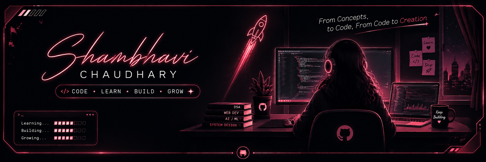
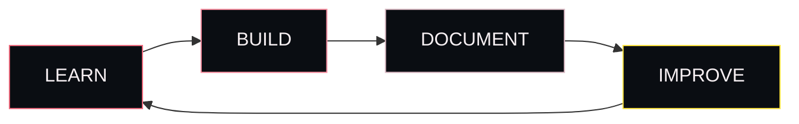

<p align="center">
  
</p>

<div align="center">

# SHAMBHAVI CHAUDHARY

`CORE_SIGNAL` · B.Tech IT · Full-Stack · AI/ML

[GitHub](https://github.com/Shambhavichaudhary) · [LinkedIn](https://www.linkedin.com/in/shambhavi-chaudhary-5a891b307) · [Email](mailto:shambhavichaudhary2005@gmail.com)

```
flight signal: ACTIVE
mode: learn → build → ship
tag: concepts → code → creation
```

</div>

<p align="center">
  
</p>

---

## CORE FLIGHT PATH


---

## LOADOUT

| Slot | Gear |
|------|------|
| Languages | C · C++ · Python · JavaScript · SQL |
| Frontend | HTML · CSS · React.js · Tailwind |
| Backend | Node.js · Express.js |
| Database | MySQL · MongoDB |
| Tools | Git · GitHub · VS Code · Figma · Canva |
| Core | DSA · OOP · STL · REST · MERN · System Design · GenAI · Web3 |

---

## ACTIVE CHANNELS

| Channel | Focus | Signal |
|---------|-------|--------|
| C & C++ | fundamentals + problem-solving | `LIVE` |
| DSA | structures + algorithms | `LIVE` |
| JavaScript | fundamentals → advanced | `SYNC` |
| React.js | modern frontend | `SYNC` |
| Node / Express | backend | `SYNC` |
| SQL & DBs | queries + design | `SYNC` |
| Python | AI/ML foundation | `LOCK` |
| MERN | full-stack glue | `SYNC` |



---

## BASE NODES

| Node | Role |
|------|------|
| [C-Workspace](https://github.com/Shambhavichaudhary/C-Workspace) | C arena |
| [CPP-Workspace](https://github.com/Shambhavichaudhary/CPP-Workspace) | C++ arena |
| [WebDev-Workspace](https://github.com/Shambhavichaudhary/WebDev-Workspace) | web builds |
| [Coding-Diary](https://github.com/Shambhavichaudhary/Coding-Diary) | flight logs |

---

## TROPHY LOG

| Type | Title | Notes |
|------|-------|-------|
| Internship | Blockchain Dev — Avishkar Tech Solutions | 6 months |
| Training | Hostel Management System (DORM) | Jun 28 – Jul 31 · certified |
| Hackathon | Smart India Hackathon (SIH) | AI crop recommendation |
| Hackathon | 36-Hour — Team TechEraa | farmer-tech build |
| Event | PromptHeist 2025 | GenAI / Opstree |

---

## UNLOCKS

| Cert | Issuer | Result |
|------|--------|--------|
| UX Design Job Simulation | Lloyds Banking Group | ✓ |
| Cyber Job Simulation | Deloitte | ✓ |
| Data Visualisation Job Simulation | Tata Group | ✓ |
| Basics of Python | Infosys Springboard | Mar 28, 2026 |
| C Programming | KnowledgeGate | 95% · Jan 10, 2026 |

---

## BUILD BAY

| Project | Status |
|---------|--------|
| Major builds · demos · writeups | `LOCKED` · drop window 2026 |

---

## STATS HUD

<p align="center">
  <picture>
    <source media="(prefers-color-scheme: dark)" srcset="https://github-readme-stats.shion.dev/api?username=Shambhavichaudhary&show_icons=true&theme=radical&hide_border=true&title_color=F7F0F3&icon_color=EF6A7D&text_color=F7F0F3&bg_color=0A0D12">
    <source media="(prefers-color-scheme: light)" srcset="https://github-readme-stats.shion.dev/api?username=Shambhavichaudhary&show_icons=true&theme=default&hide_border=true&title_color=2D1D25&icon_color=B34A5D&text_color=1D1D1D&bg_color=F6F0F1">
    
  </picture>
  <picture>
    <source media="(prefers-color-scheme: dark)" srcset="https://github-readme-streak-stats.herokuapp.com/?user=Shambhavichaudhary&theme=dark&hide_border=true&background=0A0D12&ring=EF6A7D&fire=FF93A5&currStreakLabel=F7F0F3">
    <source media="(prefers-color-scheme: light)" srcset="https://github-readme-streak-stats.herokuapp.com/?user=Shambhavichaudhary&theme=default&hide_border=true&background=F6F0F1&ring=B34A5D&fire=D35D74&currStreakLabel=1D1D1D">
    
  </picture>
</p>

<p align="center">
  <picture>
    <source media="(prefers-color-scheme: dark)" srcset="https://github-readme-stats.shion.dev/api/top-langs/?username=Shambhavichaudhary&layout=compact&theme=radical&hide_border=true&title_color=F7F0F3&text_color=F7F0F3&bg_color=0A0D12">
    <source media="(prefers-color-scheme: light)" srcset="https://github-readme-stats.shion.dev/api/top-langs/?username=Shambhavichaudhary&layout=compact&theme=default&hide_border=true&title_color=2D1D25&text_color=1D1D1D&bg_color=F6F0F1">
    
  </picture>
</p>

---

<div align="center">

### THANKS FOR VISITING ✦

**From Concepts to Code,**<br>
**From Code to Creation.**

<br>

Keep learning.<br>
Keep building.<br>
Keep shipping. 🚀

<br>

<a href="mailto:shambhavichaudhary2005@gmail.com"><code> EMAIL </code></a>
&nbsp;&nbsp;
<a href="https://www.linkedin.com/in/shambhavi-chaudhary-5a891b307"><code> LINKEDIN </code></a>

<br><br>

**Shambhavi Chaudhary**<br>
B.Tech IT • GGSIPU • 2028

<br>

<sub>Built with curiosity & code.</sub>

</div>
